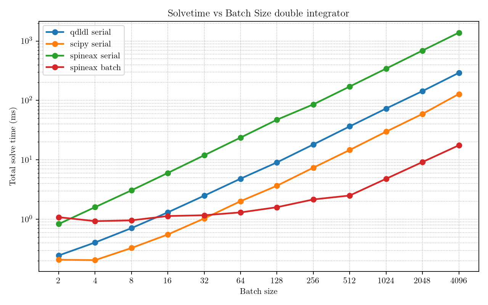
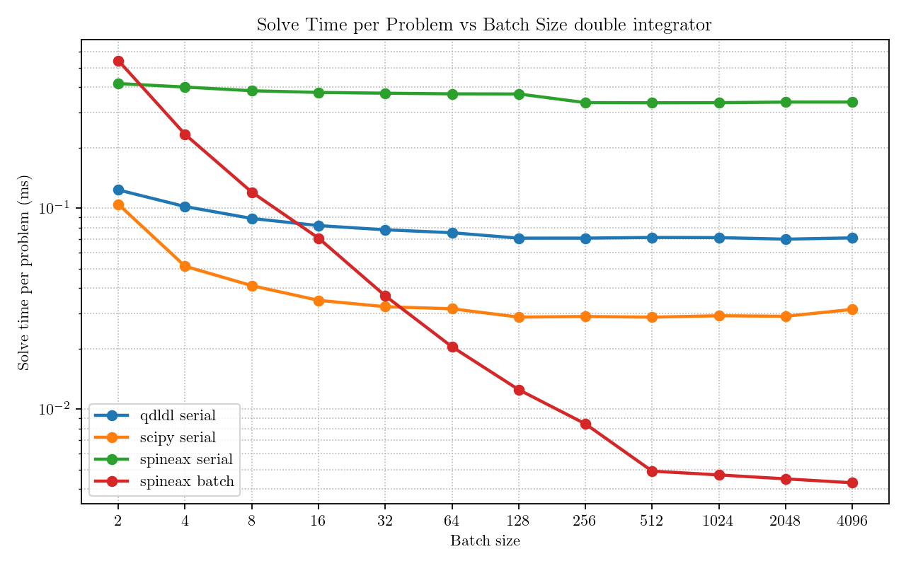
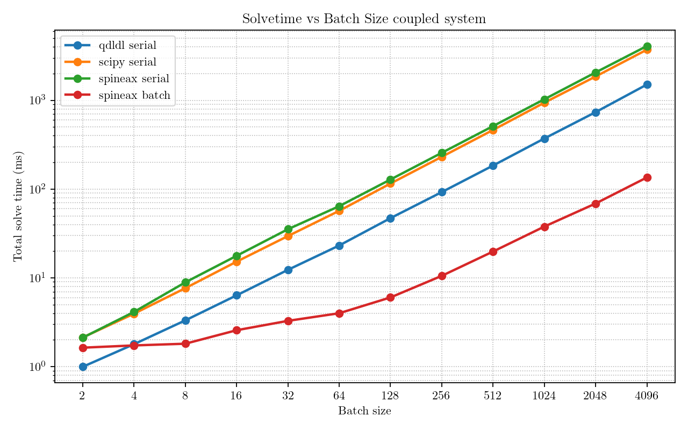
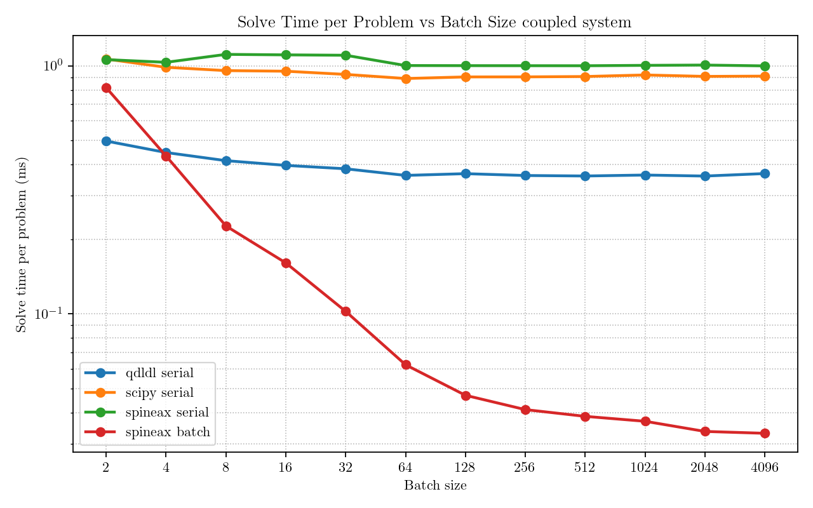

# Batch Sparse Linear System Solver Benchmark

This repository contains a standalone Python benchmark for solving sparse
KKT-style linear systems from finite-horizon LQR problems. It runs both a
standard double integrator and a larger coupled linear system. Each problem in a
batch has the same sparsity pattern but different cost data by varying the LQR
`P` block.

The main motivation is to understand the behavior of batched sparse linear
system solves as batch size changes. The script compares CPU sparse serial
solvers against Spineax/cuDSS GPU solves across increasing batch sizes.

Because the batched GPU path uses NVIDIA cuDSS through Spineax, this repository
requires a CUDA-capable NVIDIA GPU and a compatible CUDA/JAX/cuDSS installation
to run the full benchmark.

Spineax is a JAX wrapper around NVIDIA cuDSS. It exposes sparse direct solves as
JAX-callable operations, which makes it possible to batch sparse linear system
solves with transforms such as `jax.vmap`.

## Plots

<p align="center">
  
</p>

<p align="center">
  
</p>

<p align="center">
  
</p>

<p align="center">
  
</p>

## Solvers

- `qdldl serial`: CPU sparse solve, one matrix factorization and solve per
  problem.
- `scipy serial`: CPU sparse `scipy.sparse.linalg.spsolve`, one solve per
  problem.
- `spineax serial`: GPU cuDSS solve wrapped in `jax.lax.scan`, processing
  problems sequentially inside one compiled JAX call.
- `spineax batch`: GPU cuDSS solve wrapped in `jax.vmap`, solving the batch in
  parallel.

## Problems

The benchmark uses double-integrator dynamics with timestep `dt = 0.1`.

The standard problem has 2 states and 1 control:

```text
A = [[1, dt],
     [0,  1]]

B = [[0.5 * dt^2],
     [dt]]
```

The larger problem has 16 states and 8 controls. Its `A` matrix is a stable
banded/coupled linear system, and its `B` matrix maps each state to two control
channels in a fixed sparse pattern:

```text
A = 0.92 I + nearest-neighbor coupling + shifted coupling

B[i, i mod 8]       = 0.2 dt
B[i, (i + 3) mod 8] = 0.05 dt
```

Each batch entry has a distinct KKT matrix by sweeping LQR cost scales:

```text
q_scale in [0.5, 2.0]
r_scale in [2.0, 0.5]
```

The CSR sparsity pattern is shared across the batch, which is required by the
Spineax batched path.

## Findings

`qdldl serial`, `scipy serial`, and `spineax serial` scale roughly linearly with
batch size. This is expected because each method processes the batch
sequentially, so doubling the number of systems roughly doubles the total solve
time.

`spineax batch` has a two-phase behavior. For small batch sizes, increasing the
batch size does not greatly increase total solve time because the GPU is being
given more independent sparse solves to execute concurrently. Once the GPU has
enough work to saturate its available execution resources, additional systems
are handled in later waves of GPU work. Each wave still runs in parallel
internally, but the number of waves grows with batch size, so total solve time
becomes approximately linear.

The transition point depends on the size of each sparse linear system. Smaller
systems need a larger batch to fill the GPU, so the transition happens at a
higher batch size, as seen with the double integrator. Larger systems provide
more work per solve, so the GPU saturates at a smaller batch size, as seen with
the larger coupled system.
